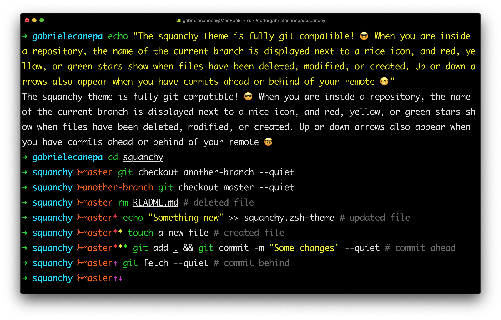
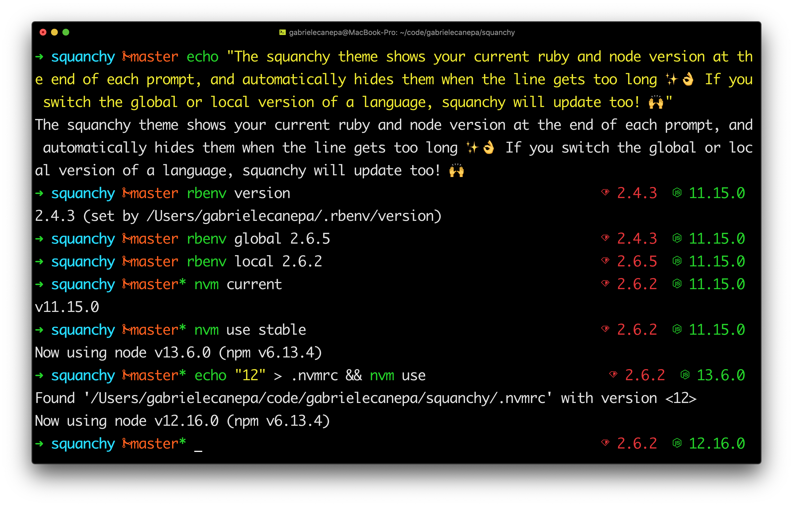

# Themes

## [Squanchy ⚡️](./squanchy.zsh-theme)





### Notes

You need a [Nerd Font](https://www.nerdfonts.com/font-downloads) and the `rbenv` and `nvm` plugins to display the icons:

```sh
# ~/.zshrc
ZSH_THEME="squanchy"

plugins=(
  # ...
  nvm
  rbenv
)
```
